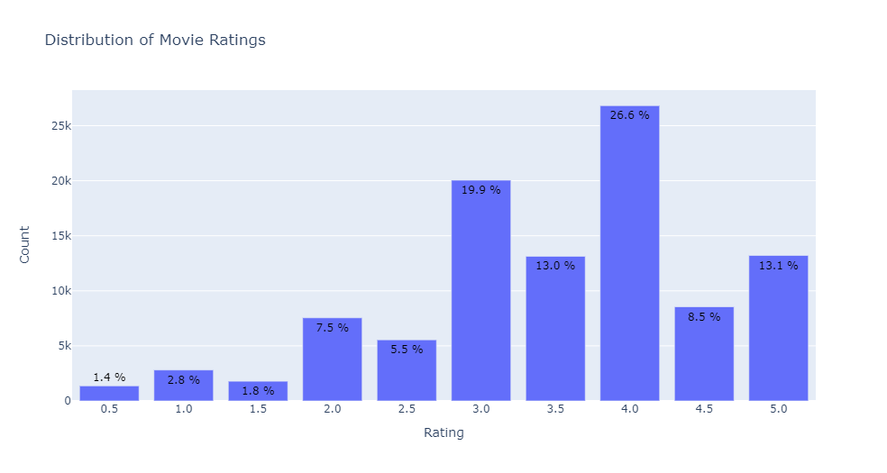
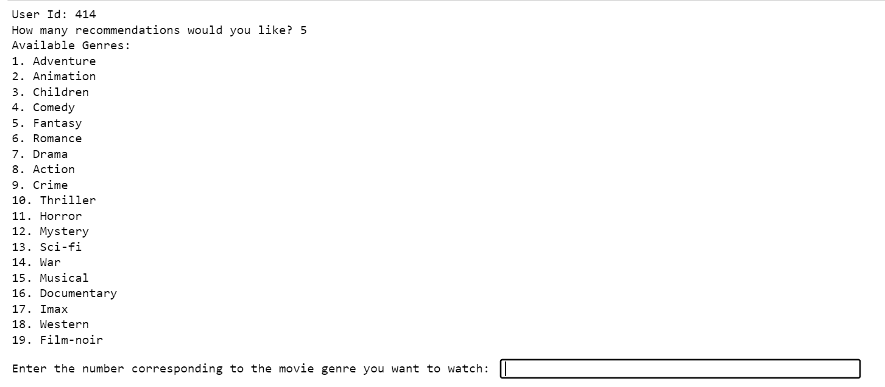

# Phase-4-Project

### Overview & Business Problem

Consumers today have thousands of movies available to them for viewing at any given moment om many different streaming platforms. While access to so much content is what drives many users to have subscriptions to multiple platforms, the sheer volumne can be overwhelming at the same time. 

The massive movie catalogs leave consumers grappling with the challenge of choice as they start their scrolling journey. While the vast selection caters to diverse tastes, the experience of navigating through countless titles can be time consuming and overwhelming. The more time users spend sifting through choices, the higher the likelihood of encountering decision fatigue, frustration, and, ultimately, moving away from using the platform. 

StreamYou is seeking to address this issue as they've observed increased scrolling time on their platform reducing their conversion rates (when users select and watch a movie). For the context of this project, I am a data scientist working on optimizing the recommendation engine at StreamYou to address the following concerns: 

<b> 1. Reduced Satisfaction: </b> Users struggle to find relevant movies, leading to decreased satisfaction with the platform.

<b> 2. Lower Conversion Rates: </b> Lengthy scrolling sessions resulting in users leaving the platform before making a selection, impacting conversion rates.

<b> 3. Lack of Genre Specific Recommendations: </b> Users don't currently have a way to express a genre preference to explicitly choose and receive recommendations based on their preferred movie genre. 

### Data Understanding and Exploration

Data used in this analysis: 
1. Movie DataFrame includes unique Movie Ids, Movie Title and Genre information 
2. Rating Dataframe includes unique User Ids, Movie Ids, Rating and Timestamp information 

The data for this project was already very clean and did not require any manipulation. There were no null values and all columns were in their expected data type objects. 

Every user in the rating dataframe has reviewed at least 20 movies and each movie has been reviewed at least once. Rating are on a scale of 1-5 with decimal values available as well. 

### Modelling and Methods

The following 4 iterative models were run. The performance of each model was evaluated using RMSE. 

1. KNN Basic: Utilizes user-item interactions, calculates similarities between users, and recommends items based on nearest neighbors.
- This model was run using both a Cosine Similarity metric and Pearson Correlation, the RMSE was .96 and .97, respectively. Due to the Cosine Similarity metric performing better, this was the metric chosen for the models going forward. 

2. KNN Means: Leverages User and Item means for data normalization. RMSE : .89. 

3. KNN Baseline: Introduces baseline predictions to address biases and combines with Cosine similarity for normalization. RMSE : .87

4. Grid Search and SVD Model: Finds the best hyper-parameters to fine tune the model. RMSE : .89
- The best parameters found by grid search for RMSE were: 
    - n_factors: 20
    - n_epochs: 10
    - lr_all: 0.005
    - reg_all: 0.4

### Selecting Final Model

The KNN Baseline was chosen as the best model as it had the lowest RMSE in the modeling process: .87. When compared to the .96 RMSE of the KNN Basic model (first model used as baseline), this is almost a full point drop which is a significant improvement on the rating scale of 1-5. 

### Demonstration

The model was used to create two functions: 

1. Allows Users to add additional movie ratings
2. Generates recommendations for users based on their inputs on the number of recommendations desired and the genre

Examples: 

Add new ratings: 

Genre Recommendations: 

### Limitations and  Potential Next Steps

One of the limitations of the final model is that it does not address the cold start problem, as in the model needs previous history from the user to build recommendations. This is a result of using user to user similarity which the final model does. 

As a next step on this analysis, it would be necessary to explore model choices that can work with information beyond user history. For example, content-based recommendations or hybrid models that use item features to make recommendations. By doing so, this recommendation model could be used more effectively when new users join the platform. 

### Conclusion

The final model addresses the three concerns outlines in the business problem section. By leveraging this model StreamYou can increase user satisifcation by helping them find relevant movies within their category of choice. Consequently, when users receive better recommendations for the specific category they want to watch, this should have an impact on the conversion rates of the platform as users will need to scroll less to find a movie. 
